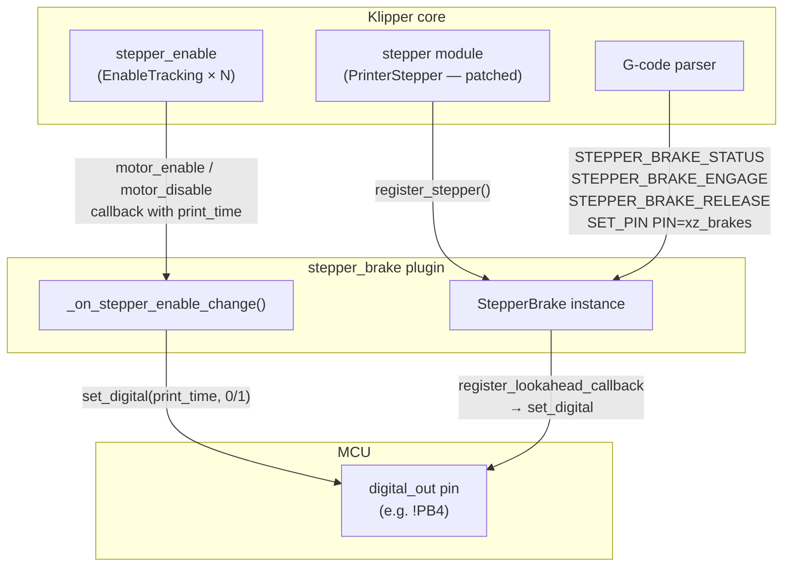
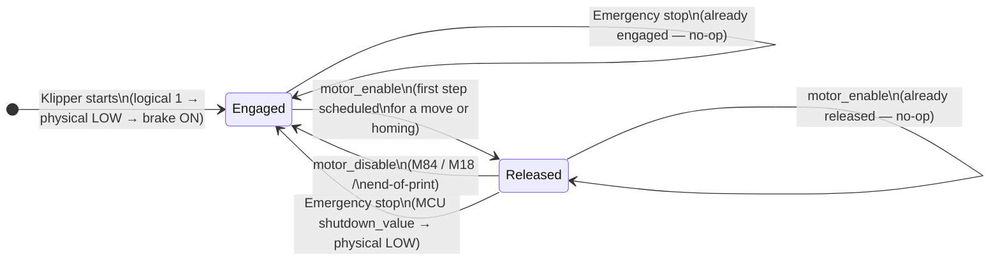
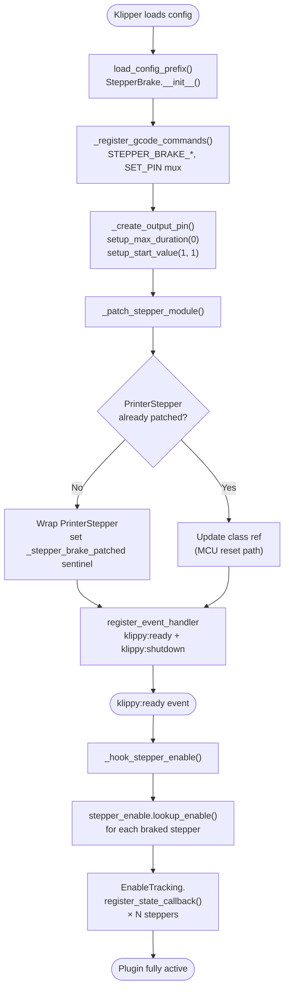
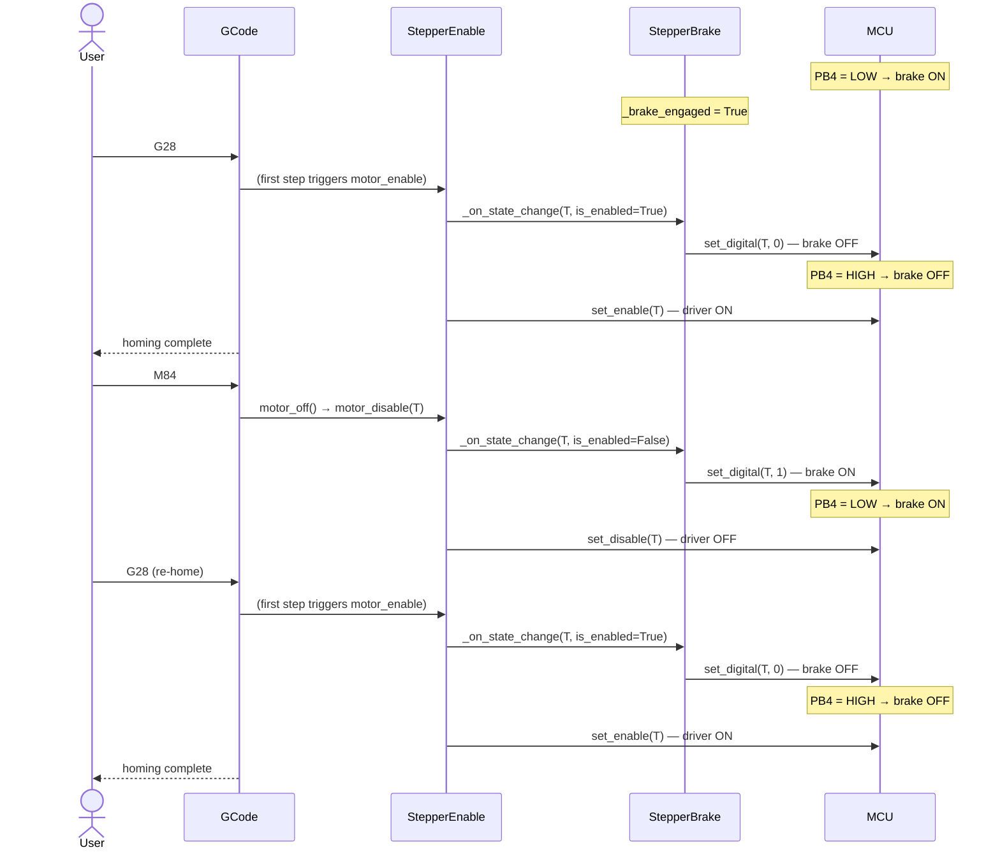

# stepper_brake — Klipper Plugin

Drives an electromagnetic stepper brake via a GPIO pin and keeps it automatically synchronised with the stepper driver enable state.

**Core rule:**
```
stepper enable ON  →  brake OFF  (motor free to move)
stepper enable OFF →  brake ON   (motor held by brake)
```

---

## Table of Contents

- [Configuration](#configuration)
- [Architecture](#architecture)
- [State Machine](#state-machine)
- [Initialisation Sequence](#initialisation-sequence)
- [Runtime Behaviour](#runtime-behaviour)
- [G-code Commands](#g-code-commands)
- [Pin Logic](#pin-logic)
- [Notes](#notes)

---

## Configuration

```ini
[stepper_brake xz_brakes]
pin: !PB4                        # GPIO pin (! = inverted, common for N.C. brakes)
stepper: stepper_x, stepper_z    # Steppers to associate with this brake
release_on_move: True            # Release brake when stepper is enabled (default True)
engage_on_motor_off: True        # Engage brake when stepper is disabled (default True)
```

Multiple `[stepper_brake <name>]` sections are supported. Each section controls one physical brake output shared across one or more steppers.

---

## Architecture



**Key design decision:** the `_on_stepper_enable_change` callback receives the exact same `print_time` the `stepper_enable` module uses to toggle the driver enable pin. Calling `set_digital()` directly at that time is therefore safe — it is the identical mechanism used by the stepper enable pin itself, requiring no additional lookahead indirection.

---

## State Machine



The no-op guards prevent writing the shared GPIO pin twice when multiple braked steppers are disabled together in `motor_off()` (both `stepper_x` and `stepper_z` fire the callback at the same `print_time`).

---

## Initialisation Sequence



The `PrinterStepper` patch runs at config-load time (before steppers are created). Each new stepper that matches a name in `stepper:` is tagged with a `_brake_engaged` state flag and appended to `brake_configs`.

---

## Runtime Behaviour

### Typical homing + disable + re-home cycle



### Timing guarantees

| Event | Source of `print_time` | Margin |
|-------|------------------------|--------|
| `motor_enable` | Step generation — start of first scheduled step | Equal to the move start time |
| `motor_disable` | `get_last_move_time()` after `dwell(0.1s)` | ≥ 250 ms ahead of MCU clock |

Both are the same `print_time` passed to `EnableTracking.motor_enable/motor_disable`. The brake pin and the driver enable pin are toggled at **identical** print times, so they change atomically from the MCU's perspective.

---

## G-code Commands

| Command | Description |
|---------|-------------|
| `STEPPER_BRAKE_STATUS` | Reports `ENGAGED` / `RELEASED` for every configured stepper |
| `STEPPER_BRAKE_ENGAGE STEPPER=<name>` | Manually engages the brake for one stepper |
| `STEPPER_BRAKE_RELEASE STEPPER=<name>` | Manually releases the brake for one stepper |
| `SET_PIN PIN=<brake_name> VALUE=1` | Engage (compatible with standard Klipper macro syntax) |
| `SET_PIN PIN=<brake_name> VALUE=0` | Release (compatible with standard Klipper macro syntax) |

Manual commands (`ENGAGE`, `RELEASE`, `SET_PIN`) route through `register_lookahead_callback` because they are called from G-code context, not from within the step-generation pipeline.

---

## Pin Logic

The plugin uses a standard Klipper `digital_out` pin with `setup_max_duration(0)` to remove the default 2-second cap (which would cause a "Scheduled digital out event will exceed max_duration" shutdown when pin changes are scheduled far ahead in the lookahead queue).

`setup_start_value(1, 1)` sets both the boot value and the emergency-shutdown value to logical `1`. The MCU XORs this with the pin's invert flag before writing the physical line:

$$\text{physical} = \text{logical} \oplus \text{invert}$$

| Config pin | `set_digital` / start value | Physical level | Brake state |
|-----------|------------------------------|----------------|-------------|
| `!PB4` (inverted) | `1` (start / shutdown) | LOW | **Engaged** |
| `!PB4` (inverted) | `0` (release) | HIGH | **Released** |
| `PB4` (normal) | `1` (start / shutdown) | HIGH | **Engaged** |
| `PB4` (normal) | `0` (release) | LOW | **Released** |

With an inverted pin (`!PB4`), the brake is engaged when the line is pulled LOW — typical for normally-closed electromagnetic brakes powered by an open-collector/drain output. `setup_start_value(1, 1)` ensures the brake is engaged both at Klipper boot and on any emergency stop or MCU shutdown, with no host-side intervention required.

### Optional: firmware-level startup pin

The `setup_start_value` guarantee takes effect when Klipper Python initialises the pin (a second or two after MCU power-on). For hardware-level assurance from the very first millisecond of power, add `!PB4` to the **"GPIO pins to set at micro-controller startup"** field in `make menuconfig`:

```
(!PB4) GPIO pins to set at micro-controller startup
```

The `!` prefix drives the pin LOW at MCU startup (before the host connects), keeping the brake engaged during the boot window.

---

## Notes

- **MCU reset** (`FIRMWARE_RESTART`): a new `StepperBrake` instance is created. The class attribute `StepperBrake._current_instance` is updated so the permanently-installed `PrinterStepper` patch closure routes calls to the new instance.
- **Emergency stop**: the `klippy:shutdown` event handler marks all `_brake_engaged` flags `True` in software. The MCU independently drives the pin to its `shutdown_value` (logical `1` → physical LOW → brake engaged) at the hardware level without needing a Python command.
- **Multiple steppers, one pin**: all steppers listed under `stepper:` share the single GPIO pin. The brake engages or releases together; per-stepper manual commands still operate on the shared pin.
- **`release_on_move: False`**: disables auto-release on motor enable. The brake must be released manually before motion; useful for testing or fail-safe configurations.
- **`engage_on_motor_off: False`**: disables auto-engage on motor disable. The brake remains in whatever state it was last set to.
